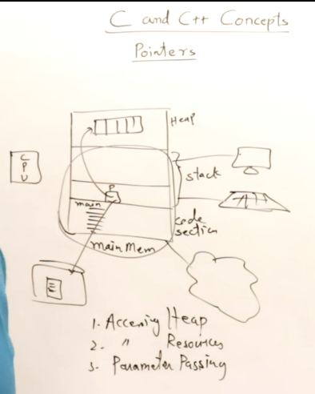

## Why pointers

> 1. Used to access the HEAP memory. Generally without pointers a program has the access only upto the STACK mem of the CPU segment.
 >
> 2. It is used to access the electronic  hardware resources such as Keyboard, Hard Drive, Printer etc.
 >
> 3. It is also generally used while parameter passing.