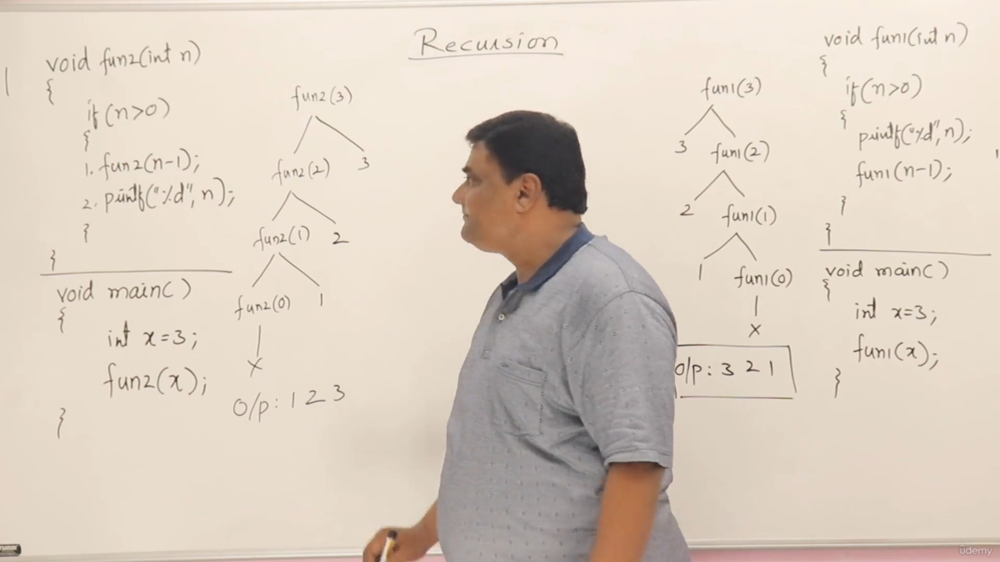
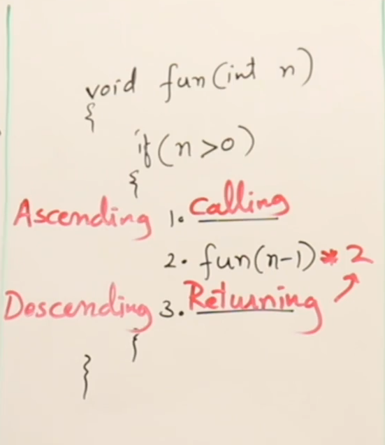
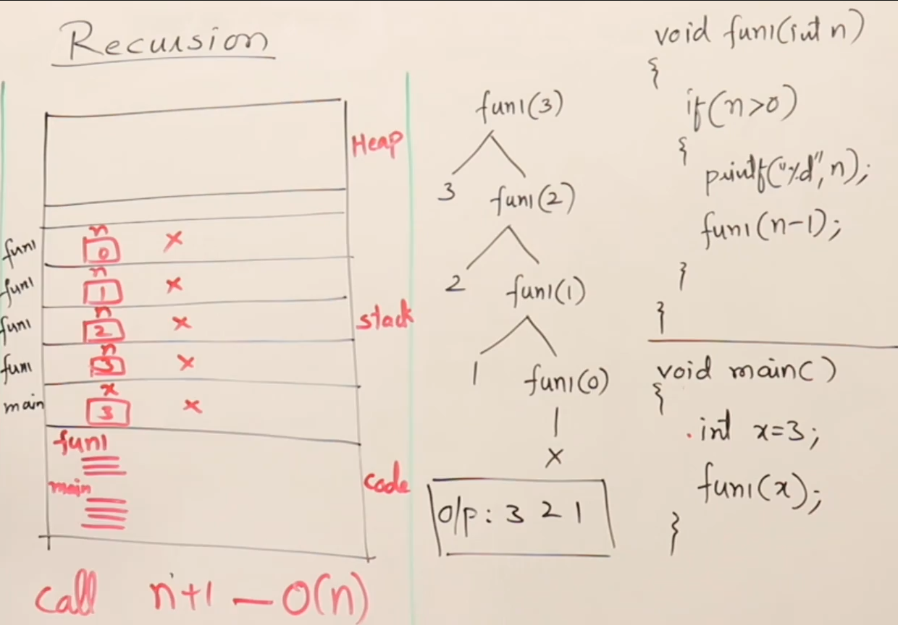
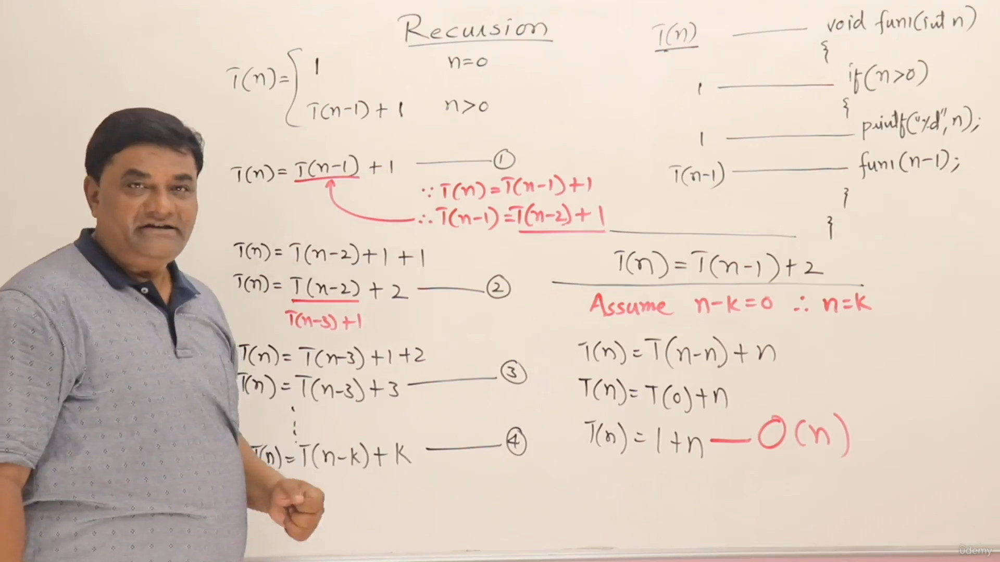

# Inside Recursion 

> **Bonus-** Recursion is good to understand it from math perspective, or implement some math easily

### Example of no statement after the function call
```cpp
#include <iostream>

void fun1(int n)
{
    if(n>0)
    {
        printf("%d",n);
        fun1(n-1);
    }
}

int main()
{
    int x=3;
    fun1(x);
    return 0;
}
```

> Output: 321


### Example of statement after the function call
```cpp
#include <iostream>

void fun2(int n){
    if(n>0)
    {
        fun1(n-1);
        printf("%d",n);
    }
}

int main(){
    int x=3;
    fun2(x);
    return 0;
}
```
> Output: 123


#### The recursion call would something like this-



### 2 phases of Recursion
1. Ascending phase
2. Descending phase

- the advantage of recursion over normal loops(for,while loops) is that of the descending phase, where normal loops have only ascending phase, recursion have both ascending and descending phase


### How recursion uses stack


- With each function call new activation record will be created in the stack, this makes Recursion consume more memory than normal loop


### Finding time complexity using recurrence relation 
