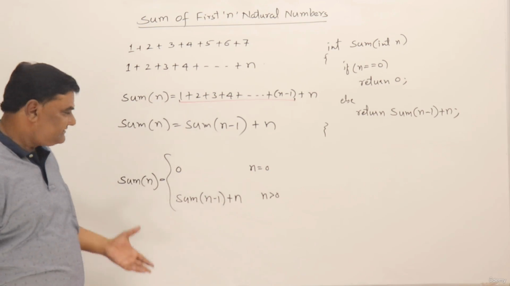

## Converting the math recurrence relation to Recursion

> Recursion is handy to easily convert the math logic into programming terms, but with that comes a disadvantage of high memory usage

## Some recursion problem with solution
#### 1. Factorial using recursion

> - n! = (n-1)! * n
>
> -   $
>f(n) =
>  \begin{cases}
>    1       & \quad \text{if, } n \text{ = 1}\\
>    f(n-1) * n  & \quad \text{if, } n \text{ > 1}
>  \end{cases}
>$

```cpp
#include <iostream>
using namespace std;

int fact(int n)
{
    if (n == 1)
        return 1;
    return n * fact(n - 1);
}

int main()
{
    cout << fact(5) << endl;
    return 0;
}
```
#### 2. Power of a number
> - m<sup>n</sup> = m<sup>(n-1)</sup> * m
> -   $
>f(n) =
>  \begin{cases}
>    1       & \quad \text{if, } n \text{ = 0}\\
>    f(n-1) * m  & \quad \text{if, } n \text{ > 0}
>  \end{cases}
>$

```cpp
#include <iostream>
using namespace std;
int m = 4;
int power(int n)
{
    if (n == 0)
        return 1;
    return m * power(n - 1);
}

int main()
{
    cout << power(3) << endl;
    return 0;
}
```