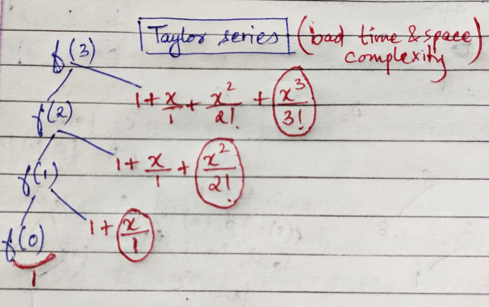
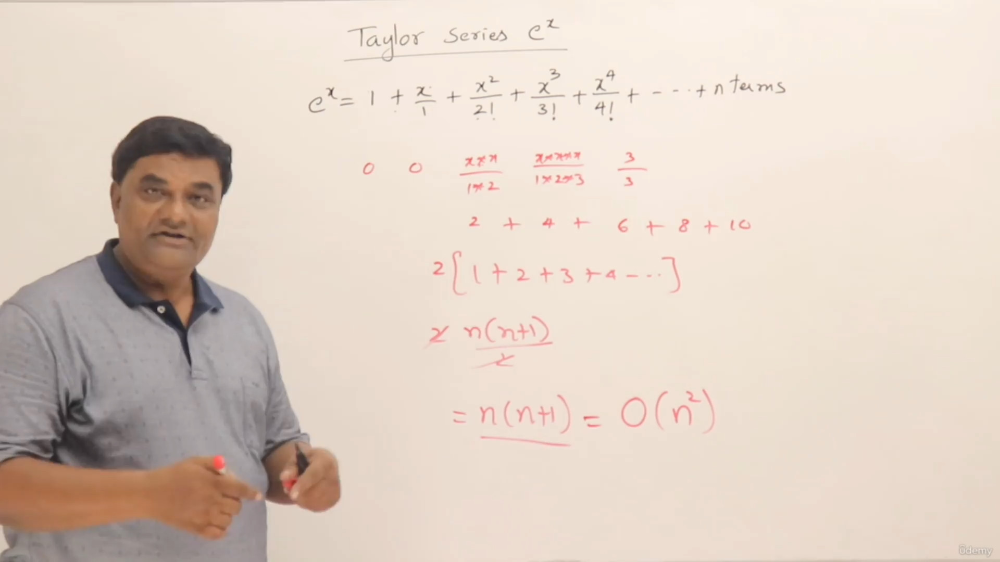
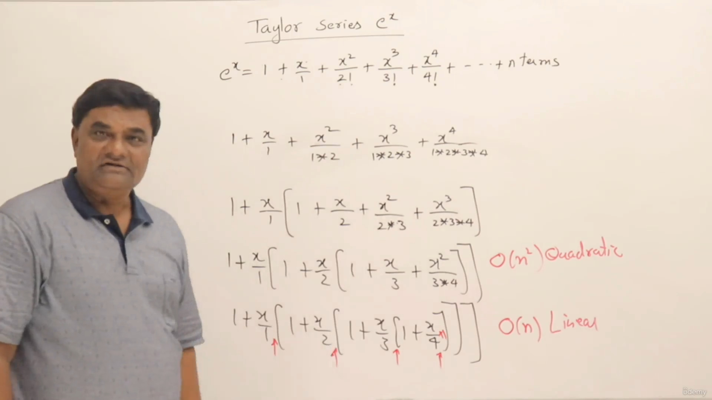
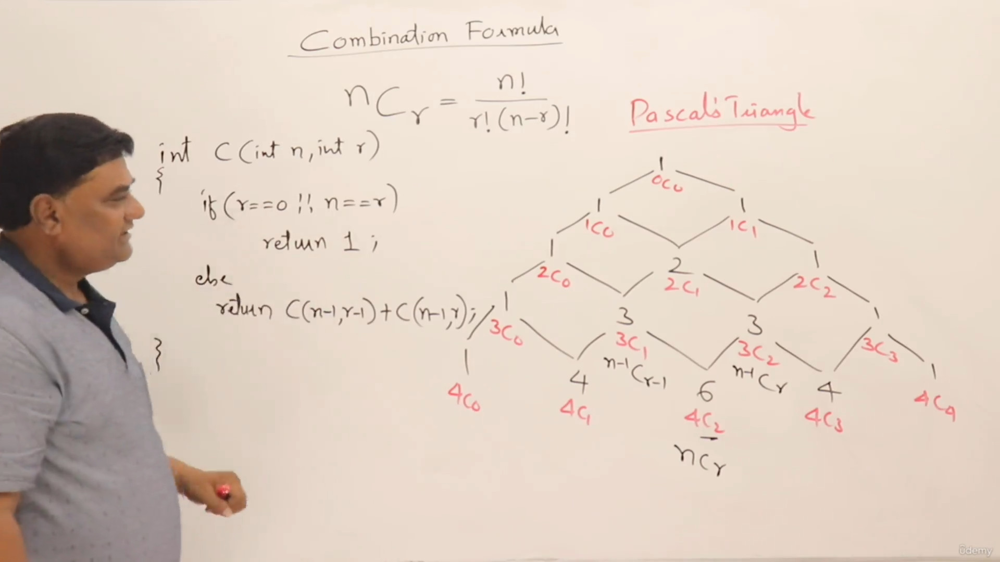

## Converting the math recurrence relation to Recursion


> Recursion is handy to easily convert the math logic into programming terms, but with that comes a disadvantage of high memory usage

## Some recursion problem with solution
### 1. Factorial using recursion

> $$n! = {(n-1)}! \times n $$

> $$
>f(n) =
>  \begin{cases}
>    1       & \quad \text{if, } n \text{ = 1}\\
>    f(n-1) n  & \quad \text{if, } n \text{ > 1}
>  \end{cases}
>$$

```cpp
#include <iostream>
using namespace std;

int fact(int n)
{
    if (n == 1)
        return 1;
    return n * fact(n - 1);
}

int main()
{
    cout << fact(5) << endl;
    return 0;
}
```
### 2. Power of a number
<!-- >  m<sup>n</sup> = m<sup>(n-1)</sup> * m   -->
> $$m^n = m ^ {(n-1)} \times m $$

> $$f(n) =
>  \begin{cases}
>    1       & \quad \text{if, } n \text{ = 0}\\
>    f(n-1) m  & \quad \text{if, } n \text{ > 0}
>  \end{cases}
>$$

```cpp
#include <iostream>
using namespace std;
int m = 4;
int power(int n)
{
    if (n == 0)
        return 1;
    return m * power(n - 1);
}

int main()
{
    cout << power(3) << endl;
    return 0;
}
```

### 3. Taylor series
 >$$e^x = 1 +  \frac{x}{1}+\frac{x^2}{2!}+\frac{x^3}{3!}+ \dots \frac{x^n}{n!}$$

>$$f(n) = f(n-1) + \frac{x^n}{n!}$$
> **NOTE:** higher the value of `n`, higher the precision

```cpp
#include <iostream>
#include <math.h>

using namespace std;

int x, n;
int fact(int n)
{
    if (n == 1)
    {
        return 1;
    }
    return fact(n - 1) * n;
}
double taylor(int n)
{
    if (n == 0)
        return 1;
    return taylor(n - 1) + pow(x, n) / fact(n);
}
int main()
{
    cout << "Enter the value of x and n \n";
    cin >> x >> n;
    cout << taylor(n) << endl;
    return 0;
}
```


#### high time and space complexity


## Optimized taylor series for recursion using Horner's Rule


- Time complexity reduced to `O(n)` from `O(n^2)`


```cpp
#include <iostream>
#include <math.h>

using namespace std;

int x, n;
double taylor(double n)
{
    static double s = 0;
    if (n == 0)
        return s;
    s = 1 + (x / n) * s;
    return taylor(n - 1);
}
int main()
{
    cout << "Enter the value of x and n \n";
    cin >> x >> n;
    cout << taylor(n) << endl;
    return 0;
}
```
### 4. Fibonacci series

>|f(n) | 0   | 1   | 1   | 2   | 3   | 5   | 8   | 13 ... |
> | ----- | --- | --- | --- | --- | --- | --- | --- | ------ |
>| n      | 0   | 1   | 2   | 3   | 4   | 5   | 6   | 7 ...  |

> $$f(n) =
>  \begin{cases}
>    0       & \quad \text{if, } n = 0\\
>    1       & \quad \text{if, } n = 1\\
>    f(n-1) + f(n-2)  & \quad \text{if, } n \text{ > 1}
>  \end{cases}
>$$

```cpp
#include <iostream>

using namespace std;

int fib(int n){
    if(n<=1){
        return n;
    }
    return fib(n-1) + fib(n-2);
} 
int main()
{
   cout << fib(7) << endl; 
}
```
using memoization- (technique of reduce the multiple calls of same function)

``` cpp
code goes here
```

### 5. nCr using recursion
Pascal's Triangle


```cpp
#include <iostream>

using namespace std;
int C(int n, int r)
{
    if (r == 0 || n == r)
        return 1;
    else
        return C(n - 1, r - 1) + C(n - 1, r);
}

int main()
{
    cout << C(4, 2); //4C2
}
```

