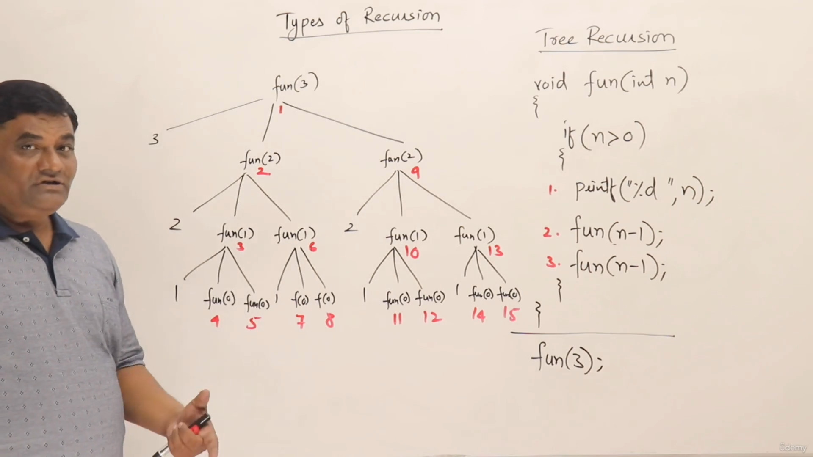
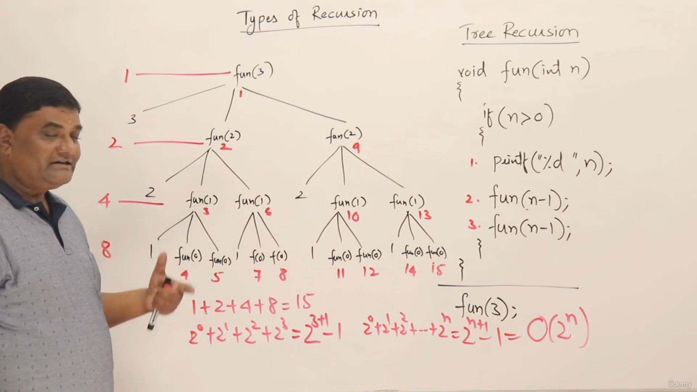
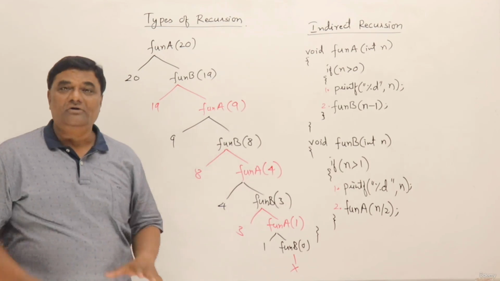
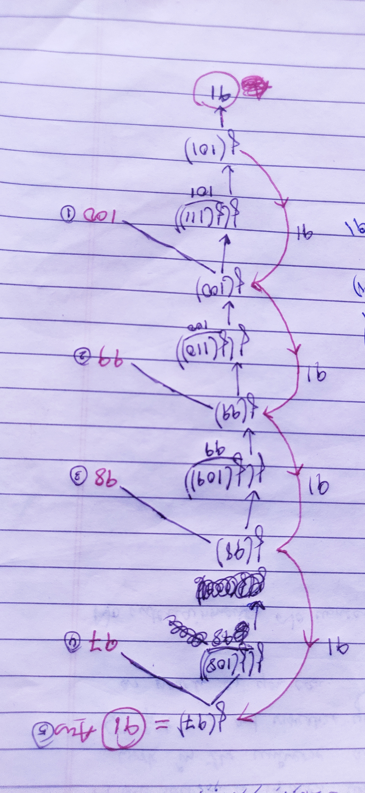

# 5 types of recursion

1. Tail recurison
2. Head recurison
3. Tree recurison
4. Indirect recurison
5. Nested recurison

## 1. Tail recursion
```cpp
void fun(int n)
{
    if(n>0)
    {
        printf("%d",n);
        fun(n-1); //when there is no statement after the recursive function call, then it is tail recursion
    }
}
```
> Time complexity: **O(n)**  
> Space complexity: **O(n)**


> Same above tail recursion example can be converted into loop, that would be more memory efficient, like this- 
>```cpp
>void fun(int x)
>{
>   while(n>0)
>    {
>       printf("%d",n);
>       n--; 
>    }  
>}
>```
> Time complexity: **O(n)**  
> Space complexity: **O(1)** (constant space)  
>
> **NOTE:** *some modern compilers internally converts (in its code optimization phase) the Tail recursion codes into its corresponding loop version to reduce the space usage*

## 2. Head recursion
```cpp
void fun(int n)
{
    if(n>0)
    {
        fun(n-1);//if the recursive function call is at the head(no statements above it), and there are some statements presents after it, then it is Head recursion
        printf("%d",n);
    }
}
```
> We can convert it into loop, but the method might not be straightforward as in Tail recursion


## 3. Tree recursion
- When there are more than one recursive function call inside the same function
```cpp
#include <iostream>
void foo(int n)
{
    if (n > 0)
    {
        printf("%d",n);
        foo(n-1);
        foo(n-1);
    }
}
int main()
{
    foo(3);
    return 0;
}
```
>Output: 3211211

#### Tree structure for the above tree recursion


- The function call sequence is number from 1 to 15, since the total function call made is 15
- As the no. of calls are 15, total 15 activation record will be made
- But, the height of the stack (space required in memory) would be same as the height of the tree(i.e, 4), as the activation records are popped off once the function is terminated (out of the loop)

#### Time and space complexity


- The time complexity would be the sum of of the number of calls made on each level of tree
- That can also be written in gp(geometrical progression) in the powers of 2.
- The sum of gp would be **2 <sup>(n+1)</sup> -1** 
> Time Complexity: *O(2<sup>n</sup>)*  
> Space Complexity: *O(n)*


## 4. Indirect recursion
A function that is calling itself not in its function scope, but indirectly from another function  


eg. in below case, the fooA() is calling itself inside the connected function fooB(), and fooB() is calling itself inside the connected function fooA()
```cpp
#include <iostream>
void fooA(int);
void fooB(int);

void fooA(int n)
{
    if (n > 0)
    {
        printf("%d ", n);
        fooB(n - 1);
    }
}
void fooB(int n)
{
    if (n > 1)
    {
        printf("%d ", n);
        fooA(n / 2);
    }
}
int main()
{
    fooA(20);
    return 0;
}
```


> **Output:** 20 19 9 8 4 3 1


## 5. Nested recursion
A recursive function as the argument to another/same function 

```cpp
#include <iostream>
int y=0;
int foo(int n)
{
    if (n > 100)
        return n - 10;
    y = foo(foo(n + 11));
    printf("%d\n", n);
    return y;
}
int main()
{
    printf("%d", foo(97));
    return 0;
}
```

