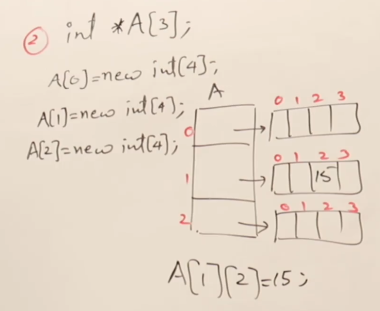
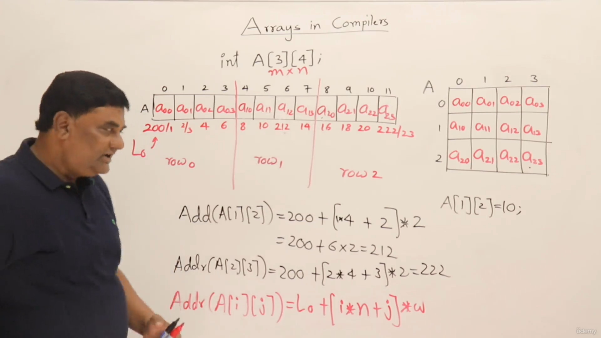
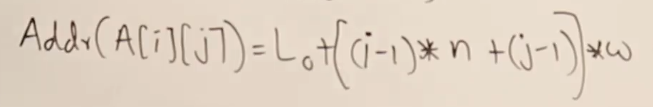
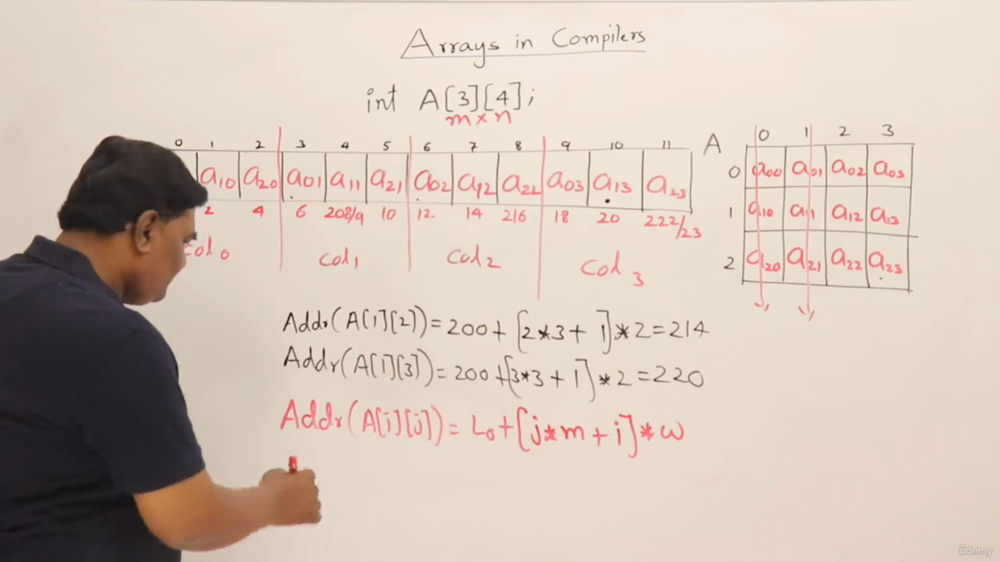
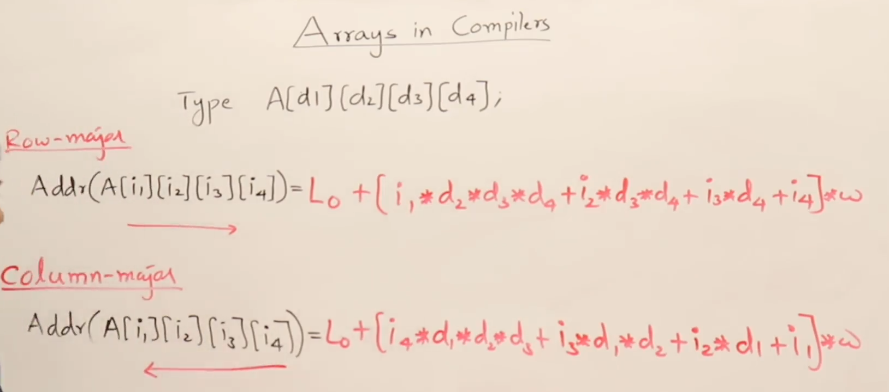
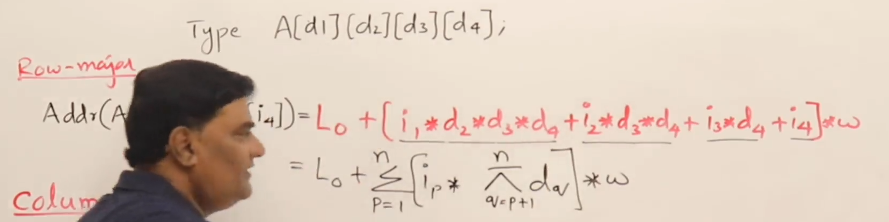
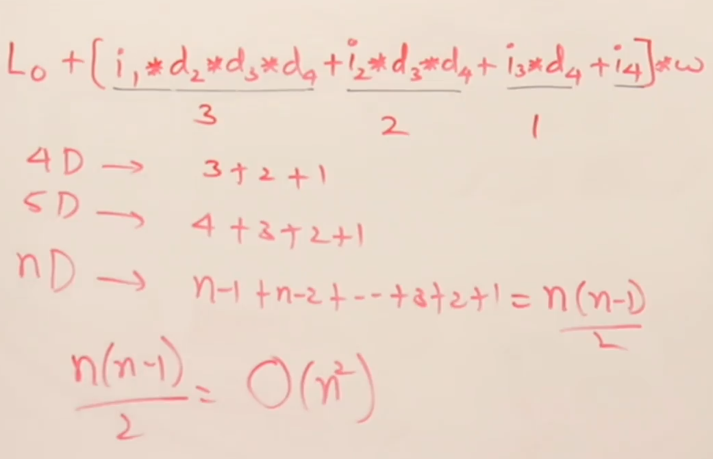

# 3 Types of 2d array declaration

#### 1. completely stored in STACK memory
 ```cpp
    int a[2][3] = {{1,6,3},{4,2,5}};
 ```

#### 2. partially stored in heap (half memory in STACK half in HEAP)
```cpp
#include <iostream>
using namespace std;

int main()
{
    int *A[3]; //in stack
    A[0] = new int[4]; //in heap
    A[1] = new int[4];
    A[2] = new int[4];

    cout << typeid(A).name() << endl; //A3_Pi (Array (size 3) of type Pointer to Int)
    cout << typeid(A[0]).name() << endl; //Pi (Pointer to int)

    A[1][3] = 14;
    cout << A[1][3];
}
```


#### 3. Everything stored in HEAP

```cpp
#include <iostream>
using namespace std;

int main()
{
    int **A;
    A = new int *[3];
    A[0] = new int[4];
    A[1] = new int[4];
    A[2] = new int[4];

    A[1][3] = 14;
    cout << A[1][3] << endl;

    cout << typeid(A).name() << endl; //PPi (pointer to Pointer Int)
    cout << typeid(A[0]).name() << endl; //Pi (Pointer to int)
}
```


# Row major and Column major mapping

For storing the array items, compilers use 2 techniques to generate the address
1. Row major mapping
2. Column major mapping
   
### 1. Row major mapping for 2d array
- For `2D`, 0-based indexed arrays

- For `2D`, 1-based Indexed arrays



### 2. Column major mapping for 2d array




>NOTE: C and C++ uses `Row major mapping`

> And there is no difference in Time and space complexity between Row or column major mappings, while designing our own compilers we can follow either of the mappings.

## Row and column major mapping for n-Dimensional arrays
  For `4D`, 0-based indexed arrays
  
 
 Generalized formula `nD` Row major mapping
 


## High time complexity of nD Row and Column Major mapping formula
The multiplication is ineffective this way, as the time complexity is O(n<sup>2</sup>)

- Optimizing above formula using `Horner's Rule`
  
  >Time complexity reduced to `O(n)`