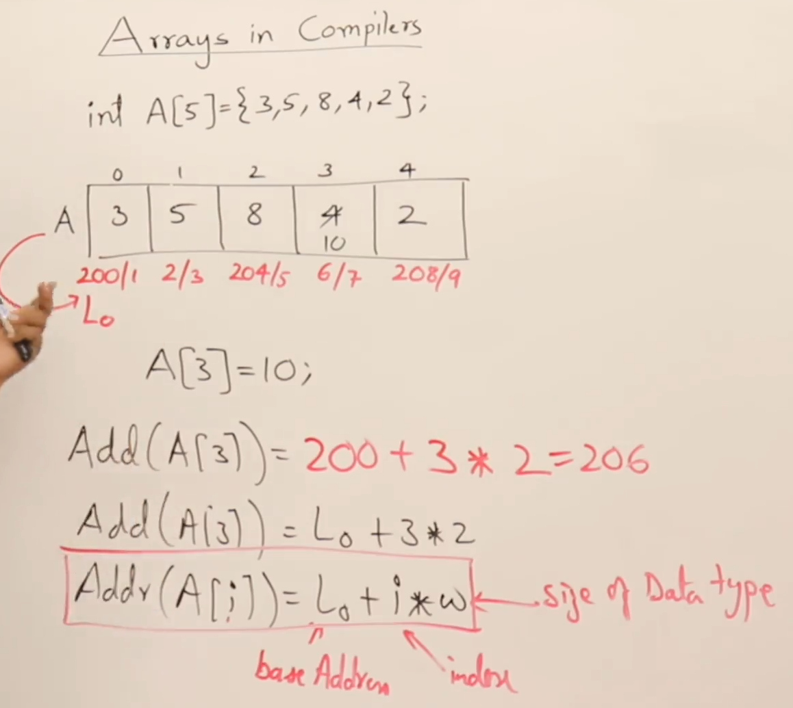

# Different types of Array representations 


- ##  Accessing array items using different ways
```cpp
#include <iostream>

using namespace std;
int main()
{
    int A[] = {3,4,5,6,6};
    cout << A[2] << endl; //index inside
    cout << 2[A] << endl; //index outside
    cout << *(A+2) << endl; //using pointer
}
```
- ## Stack vs Heap allocated array
```cpp
int *p;
p = new int[5]; //mem allocated on HEAP (as we are using `new` keyword)

int a[4]; // mem allocated on STACK
```


- ## Formula used by compiler to work with the array values
  
  1. Base Address is used to store the value of all the array items
  2. Base address will be known at the runtime of the program
  3. The address generated with the formula  (L<sub>o</sub> + i * w) is the `Logical Address` and also it is not the direct address, it is related to base address, hence, it is a `Relative Address`
###### 1. For 0-based indexed array (in C, C++, python, javascript etc)
> Address of A[i] = L<sub>o</sub> + i * w;

##### 2. For 1-based indexed array
> Address of A[i] = L<sub>o</sub> + (i-1) * w;



 Reason why 0 indexed array is preferred in modern languages-
> Notice, there are 3 operations to be done for 1 indexed arrays, whereas 0 indexed arrays only need to perform 2 operations, 1 extra operation(-) makes it ineffective for large array size, as for n array items, n extra operations of '-' has to be performed by the compiler. In case of 2d arrays, 2 extra '-' operations to be done and even more as the dimension increases.

### ``Pointer to array`` AND ``array of pointers``
>
> ``int(*p)[2];`` AND ``int *p[2];`` Both are different statement
>
> - `int(*p)[2]` is a pointer to an array of 2 int
> - `int* p[2]` is an array of 2 pointers to int
