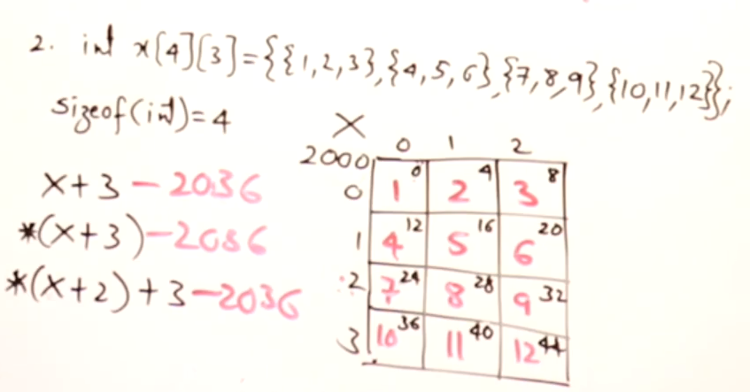

1. ```cpp
    int array[5][2] = {{1, 2}, {3, 4}, {5,6}, {7,8}};
    int(*p)[2];
    p = array;

    cout << *p[0] << *p[1] << *p[2] << *p[3];
    ```
    >output: 1357

    **DOUBT:** How is is ``int[5][2]`` convertible to ``int (*)[2]``,  whereas ``int[2][5]`` is NOT 


2. ```cpp
    int A[4][3] = {{1,2,3},{4,5,6},{7,8,9},{10,11,12}};
    cout << *(X+2)+3 << endl;
     ```
    > According to general pattern- `*(X+m)+n`, where m is the row number and n is the column number

    **DOUBT**: then, what would be the output if the m and n value increases more than the declared array size (in our case A[4][3]).
    - in our case of *(X+2)+3, `n`(column number) i.e, index 3(starting from index 0) is more than the  declared row size of 3, hence a row is increased (i.e, `m` will be `m+1`)and column count move to start from 0 again while counting

        

        i.e, `*(*(X+2)+3)` would point to row number `m+1=2+1=3` and column number to `0`, hence the output would be `10` from the above array diagram

    **But**, What would be the output if `m`( the row number) is more than the actual declared array size, lets say `*(X+6)+2` ??