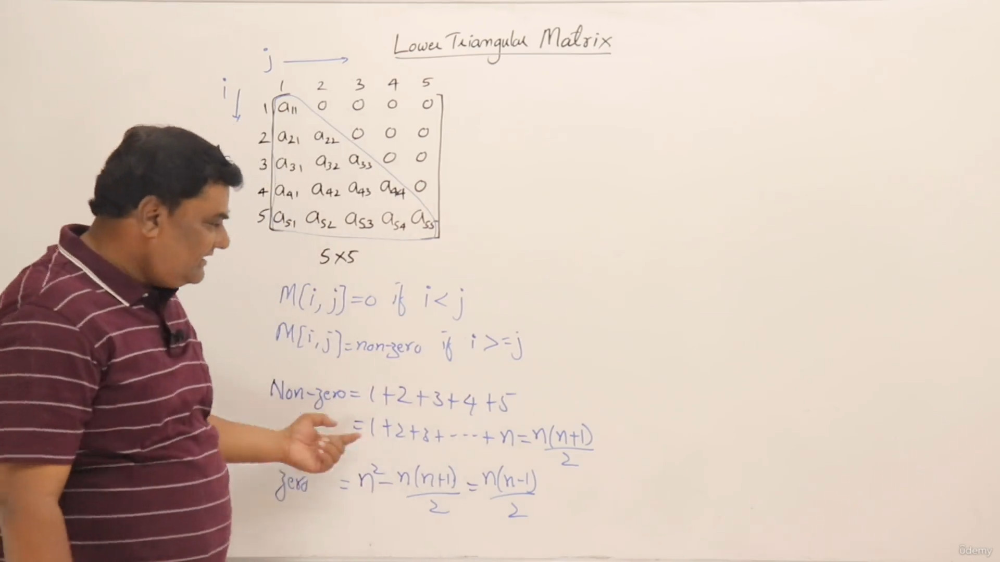

# Lower triangular matrix
$$ Non \space zeros= 1 + 2+3+4+5 \dots n =  \frac{n(n+1)}{2}
$$

$$
Zeros = n^2 - \frac{n(n+1)}{2} = \frac{n(n-1)}{2}
$$

-  `M[i,j] = 0` if `i<j`
- `M[i,j] = nonzero` if `i>=j`